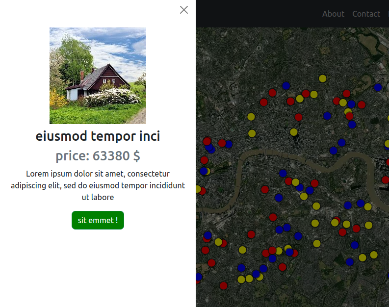

### PROJECT DETAILS 
* project name:  second inmo 
* project description:  a simple site to show markers in a map. second page for inmo project
* link: bb9e80d6.inmosite02.pages.dev

### DEPENDENCIES 
* Bootstrap
* VueJS 3 
* Mapbox 

### TODO 
* test/read some tutorials on supabase 
* try/maybe supabase service (for backend service)

### NOTES 
* 

# Web mapping Z-1

This is a static website with an interactive map embedded. This site has about, contact, privacy, terms, and main pages. The main page is a Mapbox map that contains fake points, each with a popup that shows short information. When you click on a point, an off-canvas is opened, showing more information about the point. It also has a button to filter what points to see based on color.

## Live Demo
[webmappingz1.pages.dev](https://webmappingz2.pages.dev/)

## Built with
* [Bootstrap](https://getbootstrap.com/)
* [Mapbox](https://www.mapbox.com/)
* [Vue.js](https://vuejs.org/)

## How to use
After cloning this project on your local machine, go to mapbox.com, create an account, a get a token. Open the file "Map.vue" find this variable "mapboxgl.accessToken" and paste your token there.

## License

[The Unlicense](https://unlicense.org/) 

## Contact
**Finn**

finprogrammer@mailfence.com